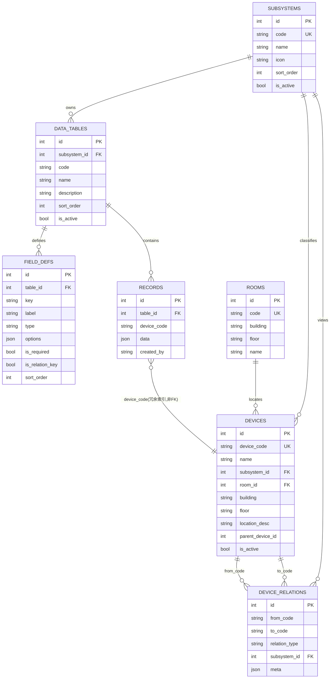
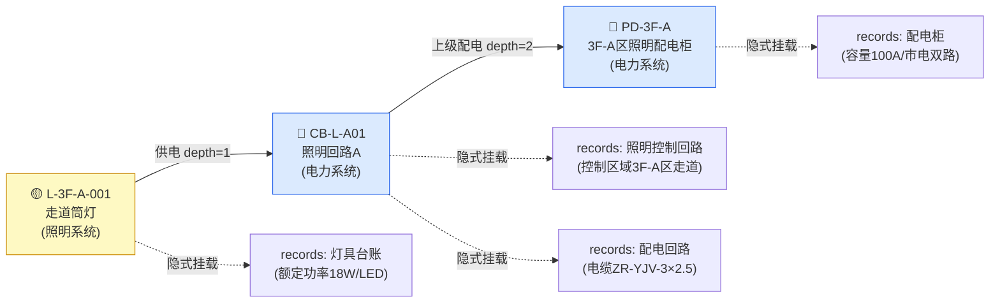
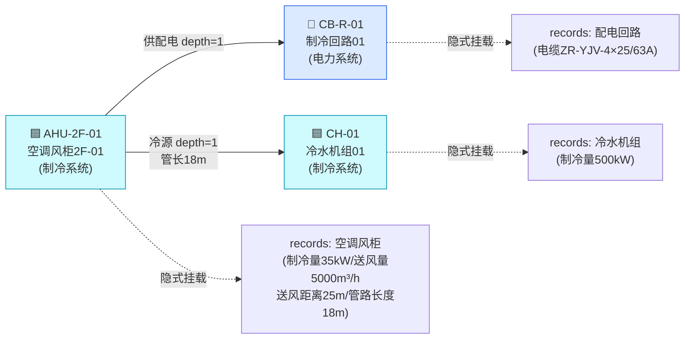
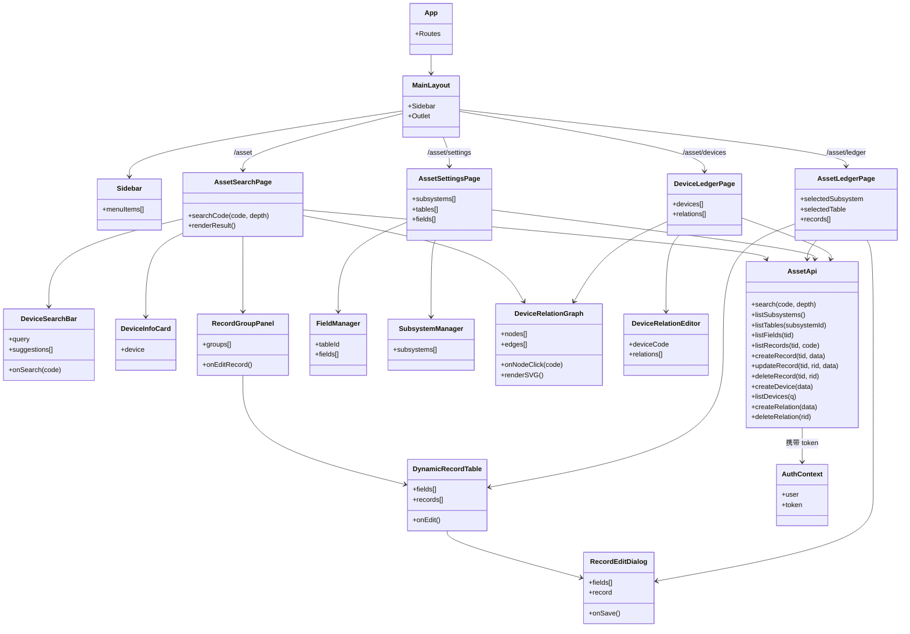
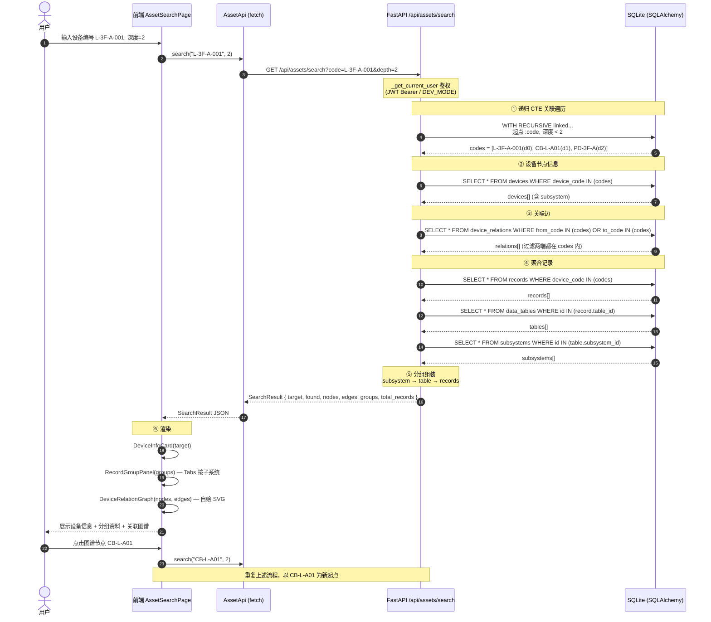
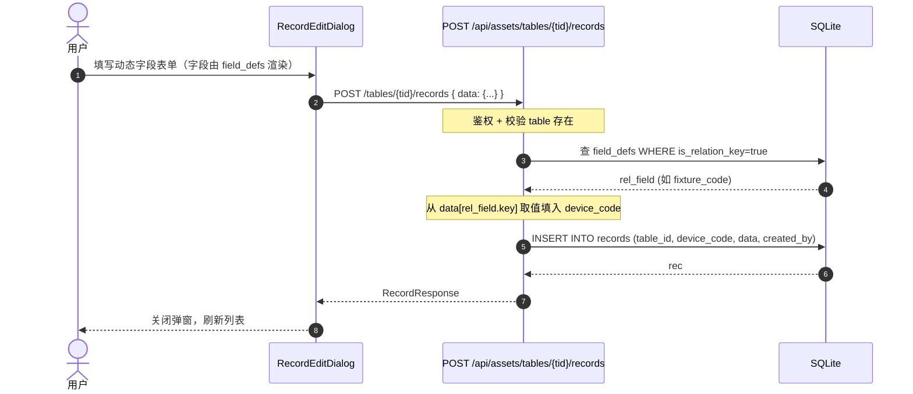

# 分系统资料管理 · 系统架构设计文档

> **版本**：v2.0（正式版，架构评审稿）
> **编写**：架构师 高见远（Gao）
> **日期**：2026-07-11
> **状态**：待评审 → 评审通过后进入实现阶段
> **前置文档**：v1.0 设计稿（已归档，本版替代）

---

## 目录

1. [需求理解与范围](#一需求理解与范围)
2. [子系统划分](#二子系统划分)
3. [数据模型设计（ER 图 + 表结构）](#三数据模型设计er-图--表结构)
4. [两种关联机制说明](#四两种关联机制说明)
5. [后端 API 设计](#五后端-api-设计)
6. [前端架构设计](#六前端架构设计)
7. [程序调用流程（时序图）](#七程序调用流程时序图)
8. [任务列表（含依赖、按实现顺序）](#八任务列表含依赖按实现顺序)
9. [依赖包列表](#九依赖包列表)
10. [共享知识 / 跨文件约定](#十共享知识--跨文件约定)
11. [待明确事项](#十一待明确事项)

---

## 一、需求理解与范围

### 1.1 核心需求复述

在「项目管理部运维系统」中新增**分系统资料管理**模块，用关联数据表的方式组织 7 个子系统（电力、消防、弱电、制冷、照明、给排水、暖通）的设备资料。核心目标：

> **输入一个设备编号，即可聚合该设备在所有子系统、所有资料表中的相关数据。**

两个典型场景：
- **搜一盏灯** → 照明系统的灯具台账 + 照明控制回路资料 + 电力系统关于这盏灯的供配电资料
- **搜空调风柜** → 制冷系统的管路、送风距离数据 + 电力系统的供配电关联数据

### 1.2 功能要点

| 编号 | 要点 | 说明 |
|------|------|------|
| F1 | 跨子系统设备追溯 | 搜一个设备编号，聚合它在所有子系统、所有资料表的相关数据 |
| F2 | 数据增删查改 | 子系统 / 资料表 / 字段 / 记录 / 设备 / 关联 全生命周期管理 |
| F3 | 资料表字段动态增加 | 字段由元数据定义，不修改表结构 |
| F4 | 主交互：搜索栏 | 顶部搜索栏输入设备编号即可找到对应设备的所有数据 |

### 1.3 范围划分（P0 / P1 / P2）

| 优先级 | 范围 | 交付物 |
|--------|------|--------|
| **P0**（最小可用） | 子系统/资料表/字段/记录/设备 CRUD + 设备全局检索（隐式挂载 + 显式关联遍历）+ 前端搜索主页 + 资料台账管理页 + 配置页 | 可投入使用的核心闭环 |
| **P1**（关联追溯增强） | 关联图谱可视化（自绘 SVG）+ 节点点击跳转 + 模糊搜索联想 + 未登记设备聚合 + 设备台账页 + 关联关系维护 | 完整的设备追溯体验 |
| **P2**（效率与扩展） | Excel 批量导入导出 + 字段类型扩展（附件/图片）+ CAD 图上点设备跳资料 + 操作日志 | 提升录入效率与集成度 |

---

## 二、子系统划分

子系统作为**可维护字典表**（非硬编码），预置 7 个，可在配置页增删改。

| code | 名称 | 图标（lucide） | 典型资料表举例 |
|------|------|----------------|----------------|
| `power` | 电力系统 | Zap | 高压柜、低压柜、配电回路、电缆清册、配电柜 |
| `fire` | 消防系统 | Flame | 火灾探测器、喷淋头、消火栓 |
| `weak` | 弱电系统 | Cable | 摄像头、广播音箱、信息点 |
| `refrig` | 制冷系统 | Snowflake | 冷水机组、空调风柜、送风管路 |
| `lighting` | 照明系统 | Lightbulb | 灯具台账、照明控制回路、照明配电箱 |
| `water` | 给排水系统 | Droplets | 水泵、管道阀门、给水管网、排水井 |
| `hvac` | 暖通系统 | Fan | 风机盘管、新风机组、送风管路 |

> **说明**：2026-07-12 已确认补充给排水（`water`）、暖通（`hvac`）两个子系统，共 7 个。字典可维护，后续追加无需改代码。

---

## 三、数据模型设计（ER 图 + 表结构）

### 3.1 现有实现评估

后端 `backend/database.py` 末尾已落地 6 张表，`backend/asset_routes.py` 已实现完整 CRUD + 检索 + 种子数据。评估结论：

| 表 | 是否满足需求 | 优化建议 |
|----|--------------|----------|
| `subsystems` | ✅ 满足 | 无 |
| `devices` | ✅ 满足 | 见 [3.3 优化点 O1](#o1未登记设备聚合) |
| `data_tables` | ✅ 满足 | 无 |
| `field_defs` | ✅ 满足 | 见 [3.3 优化点 O2](#o2字段类型扩展) |
| `records` | ✅ 满足 | 见 [3.3 优化点 O1](#o1未登记设备聚合) |
| `device_relations` | ✅ 满足 | 见 [3.3 优化点 O3](#o3设备删除级联) |

### 3.2 ER 图



### 3.3 表字段清单（已实现）

> 标注「✅已实现」的字段表示 `database.py` 中已存在；标注「🔧优化」的为 v2.0 建议增强。

#### 3.3.1 `subsystems`（子系统字典）✅已实现

| 字段 | 类型 | 约束 | 说明 |
|------|------|------|------|
| id | Integer | PK, index | |
| code | String | unique, index, not null | power/fire/weak/refrig/lighting |
| name | String | not null | 电力系统 |
| icon | String | default "" | lucide 图标名 |
| sort_order | Integer | default 0 | |
| is_active | Boolean | default True | |
| created_at / updated_at | DateTime | | |

#### 3.3.2 `devices`（设备主表 / 全局设备台账）✅已实现

| 字段 | 类型 | 约束 | 说明 |
|------|------|------|------|
| id | Integer | PK | |
| device_code | String | unique, index, not null | **检索主键** |
| name | String | not null | |
| subsystem_id | Integer | FK→subsystems, nullable | 主归属子系统 |
| room_id | Integer | FK→rooms, nullable | 所在机房（复用 rooms） |
| building / floor | String | default "" | |
| location_desc | String | default "" | |
| parent_device_id | Integer | nullable | 设备层级（回路→配电柜） |
| is_active | Boolean | default True | |
| created_at / updated_at | DateTime | | |

#### 3.3.3 `data_tables`（资料表元数据）✅已实现

| 字段 | 类型 | 约束 | 说明 |
|------|------|------|------|
| id | Integer | PK | |
| subsystem_id | Integer | FK→subsystems, not null | |
| code | String | not null | 表标识，如 lighting_fixtures |
| name | String | not null | 中文名，如"灯具台账" |
| description | String | default "" | |
| sort_order / is_active | | | |
| created_at / updated_at | DateTime | | |

> 联合唯一约束建议：`(subsystem_id, code)`（当前仅代码层校验，未加 DB 约束，🔧优化建议补加）。

#### 3.3.4 `field_defs`（字段定义 · 动态字段）✅已实现

| 字段 | 类型 | 约束 | 说明 |
|------|------|------|------|
| id | Integer | PK | |
| table_id | Integer | FK→data_tables, not null | |
| key | String | not null | 字段标识，如 rated_power |
| label | String | not null | 显示名 |
| type | String | default "text" | text/number/date/select/device_ref |
| options | JSON | default [] | select 可选项 |
| is_required | Boolean | default False | |
| is_relation_key | Boolean | default False | **关联键**：值为 device_code，记录据此挂载 |
| sort_order | Integer | default 0 | |
| created_at / updated_at | DateTime | | |

##### O2：字段类型扩展建议

当前 5 种类型已覆盖 P0/P1。P2 建议扩展：
- `textarea`：长文本（备注类）
- `image`：设备照片/附件（存 `/uploads/assets/` 路径）
- `multi_select`：多选

#### 3.3.5 `records`（资料记录）✅已实现

| 字段 | 类型 | 约束 | 说明 |
|------|------|------|------|
| id | Integer | PK | |
| table_id | Integer | FK→data_tables, not null | |
| device_code | String | index, default "" | **冗余索引列**（由关联键填充，非 FK） |
| data | JSON | default {} | 动态字段值 {key: value} |
| created_by | String | default "" | |
| created_at / updated_at | DateTime | | |

> **关键设计**：`device_code` 故意不设外键约束，允许"未在 devices 表登记的编号"也能挂载资料。但当前 `search` API 的递归 CTE 起点要求设备必须存在于 devices 表，导致未登记设备搜不到——见 [O1 优化](#o1未登记设备聚合)。

#### 3.3.6 `device_relations`（设备关联关系图）✅已实现

| 字段 | 类型 | 约束 | 说明 |
|------|------|------|------|
| id | Integer | PK | |
| from_code | String | index, not null | 起点 device_code（非 FK） |
| to_code | String | index, not null | 终点 device_code（非 FK） |
| relation_type | String | default "关联" | 供电/控制/管路/送风/信号/上级配电/取电/冷源 |
| subsystem_id | Integer | FK→subsystems, nullable | 该关系属于哪个子系统视角 |
| meta | JSON | default {} | 附加属性：距离/长度/线径 |
| created_at | DateTime | | |

### 3.4 优化建议（v2.0 提出）

#### O1：未登记设备聚合

**问题**：`asset_routes.py:365` 的 `search_device` 中，递归 CTE 起点 `SELECT device_code, 0 FROM devices WHERE device_code = :code`，若设备未登记则 CTE 返回空，连带隐式聚合也失败（`codes` 为空）。

**优化方案**：CTE 起点改为 `records.device_code` 也能命中：

```sql
-- 优化后：起点同时查 devices 和 records
WITH RECURSIVE linked(code, depth) AS (
    SELECT :code AS code, 0
    UNION ALL
    SELECT
        CASE WHEN r.from_code = linked.code THEN r.to_code ELSE r.from_code END,
        linked.depth + 1
    FROM device_relations r
    INNER JOIN linked ON r.from_code = linked.code OR r.to_code = linked.code
    WHERE linked.depth < :depth
)
SELECT code, MIN(depth) AS depth FROM linked GROUP BY code
```

即去掉 CTE 起点对 `devices` 表的依赖，直接以 `:code` 为起点。隐式聚合 `records WHERE device_code IN (codes)` 自然能命中。`target` 设备信息若 devices 表无记录则返回 `null`，但 `found` 仍可为 `True`（只要 records 有数据）。

**影响文件**：`backend/asset_routes.py` 的 `search_device` 函数。

#### O2：字段类型扩展

见 [3.3.4](#o2字段类型扩展建议)。

#### O3：设备删除级联（已确认：保留 records）

**问题**：`asset_routes.py:321` 的 `delete_device` 仅删除 devices 表行，未清理 `records.device_code` 和 `device_relations` 中的引用。

**已确认决策（2026-07-12，Q6）**：设备删除时 **保留历史资料 records**，仅清理其关联关系 `device_relations`，并将设备行置 `is_active=false`（软删除，而非物理删除）。这样即便设备"报废/注销"，其历史资料仍可被检索聚合。

**优化方案（软删除）**：
```python
# 软删除设备：保留 records，仅清 relations，置 is_active=false
db.query(DeviceRelation).filter(
    (DeviceRelation.from_code == obj.device_code) |
    (DeviceRelation.to_code == obj.device_code)
).delete()
obj.is_active = False
obj.updated_at = datetime.now(timezone.utc)
db.commit()
```

#### O4：关联遍历深度控制

当前默认 `depth=2`，前端可传参调整。建议：
- 默认 2 跳（覆盖"灯→回路→配电柜"3 层）
- 最大限制 5 跳（防止全图遍历性能问题）
- 在 `search_device` 中加 `depth = min(max(depth, 1), 5)` 钳制

#### O5：联合唯一约束

`data_tables (subsystem_id, code)` 与 `field_defs (table_id, key)` 建议加 DB 级联合唯一约束，当前仅代码层校验。

---

## 四、两种关联机制说明

### 4.1 机制对比

| 机制 | 载体 | 解决什么 | 举例 |
|------|------|----------|------|
| **隐式挂载** | `records.device_code` | 同一设备在多张资料表里的直接资料 | 灯 L-3F-A-001 在灯具台账、控制回路表各有记录 |
| **显式关联** | `device_relations` | 设备间的物理/逻辑链路，追溯上下游 | 灯 L-3F-A-001 →供电→ 回路 CB-L-A01 →上级配电→ 配电柜 PD-3F-A |

用户的两个例子都需要**显式关联**：电力系统的资料载体是回路/配电柜（不是灯本身），靠"灯→回路→配电柜"的关系链跳到电力系统的设备，再取其资料。

### 4.2 场景一：搜灯（L-3F-A-001）



**检索路径**：
1. CTE 起点 L-3F-A-001（depth=0）
2. 沿 `device_relations` 找到 CB-L-A01（depth=1，关系"供电"）
3. 继续找到 PD-3F-A（depth=2，关系"上级配电"）
4. 聚合 {L-3F-A-001, CB-L-A01, PD-3F-A} 在所有资料表的记录
5. 分组返回：照明系统（灯具台账）+ 电力系统（照明控制回路 via CB-L-A01、配电回路 via CB-L-A01、配电柜 via PD-3F-A）

### 4.3 场景二：搜空调风柜（AHU-2F-01）



**检索路径**：
1. CTE 起点 AHU-2F-01（depth=0）
2. 沿 `device_relations` 找到 CB-R-01（depth=1，"供配电"，电力系统）和 CH-01（depth=1，"冷源"，制冷系统，meta 含 pipe_length=18m）
3. 聚合 {AHU-2F-01, CB-R-01, CH-01} 的记录
4. 分组返回：制冷系统（空调风柜 + 冷水机组）+ 电力系统（配电回路 via CB-R-01）

---

## 五、后端 API 设计

统一前缀 `/api/assets`，挂载于 `backend/asset_routes.py`，已在 `main.py` 通过 `app.include_router(asset_router)` 注册。

### 5.1 端点清单

| 方法 | 路径 | 入参 | 出参 | 鉴权 | 状态 |
|------|------|------|------|------|------|
| GET | `/api/assets/search` | `?code=XXX&depth=2` | `SearchResult` | 登录 | ✅已实现 |
| GET | `/api/assets/subsystems` | - | `Subsystem[]` | 登录 | ✅已实现 |
| POST | `/api/assets/subsystems` | `SubsystemCreate` | `SubsystemResponse` | 管理员 | ✅已实现 |
| PUT | `/api/assets/subsystems/{sid}` | `SubsystemUpdate` | `SubsystemResponse` | 管理员 | ✅已实现 |
| DELETE | `/api/assets/subsystems/{sid}` | - | `{success}` | 管理员 | ✅已实现（级联删表/字段/记录） |
| GET | `/api/assets/tables` | `?subsystem_id=` | `DataTable[]` | 登录 | ✅已实现 |
| GET | `/api/assets/tables/{tid}` | - | `DataTable` | 登录 | ✅已实现 |
| POST | `/api/assets/tables` | `DataTableCreate` | `DataTableResponse` | 管理员 | ✅已实现 |
| PUT | `/api/assets/tables/{tid}` | `DataTableUpdate` | `DataTableResponse` | 管理员 | ✅已实现 |
| DELETE | `/api/assets/tables/{tid}` | - | `{success}` | 管理员 | ✅已实现（级联删字段/记录） |
| GET | `/api/assets/tables/{tid}/fields` | - | `FieldDef[]` | 登录 | ✅已实现 |
| POST | `/api/assets/tables/{tid}/fields` | `FieldDefCreate` | `FieldDefResponse` | 管理员 | ✅已实现 |
| PUT | `/api/assets/tables/{tid}/fields/{fid}` | `FieldDefUpdate` | `FieldDefResponse` | 管理员 | ✅已实现 |
| DELETE | `/api/assets/tables/{tid}/fields/{fid}` | - | `{success}` | 管理员 | ✅已实现 |
| GET | `/api/assets/tables/{tid}/records` | `?device_code=` | `Record[]` | 登录 | ✅已实现 |
| POST | `/api/assets/tables/{tid}/records` | `RecordCreate` | `RecordResponse` | 登录 | ✅已实现（自动从关联键填充 device_code） |
| PUT | `/api/assets/tables/{tid}/records/{rid}` | `RecordUpdate` | `RecordResponse` | 登录 | ✅已实现 |
| DELETE | `/api/assets/tables/{tid}/records/{rid}` | - | `{success}` | 登录 | ✅已实现 |
| GET | `/api/assets/devices` | `?q=&subsystem_id=` | `Device[]` | 登录 | ✅已实现（limit 200） |
| POST | `/api/assets/devices` | `DeviceCreate` | `DeviceResponse` | 登录 | ✅已实现 |
| PUT | `/api/assets/devices/{did}` | `DeviceUpdate` | `DeviceResponse` | 登录 | ✅已实现 |
| DELETE | `/api/assets/devices/{did}` | - | `{success}` | 登录 | ✅已实现（🔧优化：级联清理见 O3） |
| GET | `/api/assets/relations` | `?from_code=&to_code=` | `DeviceRelation[]` | 登录 | ✅已实现 |
| POST | `/api/assets/relations` | `DeviceRelationCreate` | `DeviceRelationResponse` | 登录 | ✅已实现 |
| DELETE | `/api/assets/relations/{rid}` | - | `{success}` | 登录 | ✅已实现 |

### 5.2 完备性评估与补强建议

| 缺口 | 优先级 | 建议 |
|------|--------|------|
| 模糊搜索联想端点 | P1 | 复用 `GET /devices?q=` 即可（已实现，limit 200），前端做防抖 |
| 未登记设备聚合 | P1 | 见 [O1](#o1未登记设备聚合)，修改 `search_device` 的 CTE 起点 |
| 关联更新端点 | P1 | 当前缺 `PUT /relations/{rid}`，建议补全 |
| 设备删除级联 | P1 | 见 [O3](#o3设备删除级联) |
| Excel 批量导入 | **本次（P0.5）** | 新增 `POST /api/assets/tables/{tid}/import`（接受 xlsx，按 field_defs 解析） |
| Excel 导出 | **本次（P0.5）** | 新增 `GET /api/assets/tables/{tid}/export`（返回 xlsx） |
| 字段类型扩展 | P2 | 见 [O2](#o2字段类型扩展建议) |
| 操作日志 | P2 | 复用现有日志机制（如有） |

### 5.3 搜索返回结构（`SearchResult`）

```jsonc
{
  "target": {                          // 目标设备信息（未登记时为 null）
    "device_code": "L-3F-A-001",
    "name": "走道筒灯",
    "subsystem_id": 5,
    "subsystem_name": "照明系统",
    "building": "GTC", "floor": "3F",
    "location_desc": "3F-A区走道"
  },
  "found": true,                       // 是否找到任何数据（设备或记录）
  "nodes": [                           // 关联设备节点（含目标自身）
    { "device_code": "L-3F-A-001", "name": "走道筒灯", "subsystem_code": "lighting", "subsystem_name": "照明系统", "depth": 0 },
    { "device_code": "CB-L-A01", "name": "照明回路A", "subsystem_code": "power", "subsystem_name": "电力系统", "depth": 1 },
    { "device_code": "PD-3F-A", "name": "3F-A区照明配电柜", "subsystem_code": "power", "subsystem_name": "电力系统", "depth": 2 }
  ],
  "edges": [                           // 关联边（供前端画图）
    { "from": "L-3F-A-001", "to": "CB-L-A01", "type": "供电", "subsystem_code": "power" },
    { "from": "CB-L-A01", "to": "PD-3F-A", "type": "上级配电", "subsystem_code": "power" }
  ],
  "groups": [                          // 按子系统分组的资料记录
    {
      "subsystem_code": "lighting",
      "subsystem_name": "照明系统",
      "subsystem_icon": "Lightbulb",
      "tables": [
        { "table_id": 1, "table_code": "lighting_fixtures", "table_name": "灯具台账",
          "records": [ { "id": 1, "device_code": "L-3F-A-001", "data": {"rated_power":"18W","light_source":"LED"}, ... } ] }
      ]
    },
    {
      "subsystem_code": "power",
      "subsystem_name": "电力系统",
      "subsystem_icon": "Zap",
      "tables": [
        { "table_id": 3, "table_code": "power_circuits", "table_name": "配电回路",
          "records": [ { "device_code": "CB-L-A01", "data": {"cable":"ZR-YJV-3×2.5","current":"16A"}, ... } ] },
        { "table_id": 4, "table_code": "power_panels", "table_name": "配电柜",
          "records": [ { "device_code": "PD-3F-A", "data": {"capacity":"100A","incoming":"市电双路"}, ... } ] }
      ]
    }
  ],
  "total_records": 4
}
```

---

## 六、前端架构设计

前端尚未接入资料管理模块。以下为全新设计，复用现有 React 19 + Vite 6 + TS + Tailwind + shadcn/ui 栈。

### 6.1 新增文件列表

| 类型 | 相对路径（相对项目根 `inspection-system/`） | 说明 |
|------|----------------------------------------------|------|
| 页面 | `src/pages/asset/AssetSearchPage.tsx` | 资料搜索主页（P0） |
| 页面 | `src/pages/asset/AssetLedgerPage.tsx` | 资料台账管理页（P0） |
| 页面 | `src/pages/asset/AssetSettingsPage.tsx` | 子系统/资料表/字段配置页（P0） |
| 页面 | `src/pages/asset/DeviceLedgerPage.tsx` | 设备台账管理页（P1） |
| 组件 | `src/components/asset/DeviceSearchBar.tsx` | 搜索栏（含联想，P0/P1） |
| 组件 | `src/components/asset/DeviceInfoCard.tsx` | 设备信息卡（P0） |
| 组件 | `src/components/asset/RecordGroupPanel.tsx` | 按子系统分组的资料面板（P0） |
| 组件 | `src/components/asset/DynamicRecordTable.tsx` | 动态字段记录表（P0） |
| 组件 | `src/components/asset/RecordEditDialog.tsx` | 记录新增/编辑弹窗（P0） |
| 组件 | `src/components/asset/FieldManager.tsx` | 字段定义管理（P0） |
| 组件 | `src/components/asset/SubsystemManager.tsx` | 子系统管理（P0） |
| 组件 | `src/components/asset/DeviceRelationGraph.tsx` | 关联图谱（自绘 SVG，P1） |
| 组件 | `src/components/asset/DeviceRelationEditor.tsx` | 关联关系维护（P1） |
| UI | `src/components/ui/tabs.tsx` | Tabs 组件（shadcn，@radix-ui/react-tabs 已装，需新建文件） |
| API | `src/services/assetApi.ts` | 资料管理 API 封装（独立文件，避免 api.ts 膨胀） |
| 类型 | `src/types/asset.ts` | 资料管理 TS 类型定义 |
| 修改 | `src/App.tsx` | 新增 4 条路由 |
| 修改 | `src/components/layout/Sidebar.tsx` | 新增"资料管理"一级菜单（含 4 个子项或折叠组） |

### 6.2 前端组件/模块关系图



### 6.3 路由与菜单设计

#### 路由（修改 `src/App.tsx`）

```tsx
<Route path="asset" element={<AssetSearchPage />} />
<Route path="asset/ledger" element={<AssetLedgerPage />} />
<Route path="asset/settings" element={<AssetSettingsPage />} />
<Route path="asset/devices" element={<DeviceLedgerPage />} />
```

#### 菜单（修改 `src/components/layout/Sidebar.tsx`）

在现有 `menuItems` 数组中新增「资料管理」分组（含 4 项）：

```tsx
{ icon: Search, label: '资料搜索', path: '/asset', adminOnly: false },
{ icon: Database, label: '资料台账', path: '/asset/ledger', adminOnly: false },
{ icon: Cpu, label: '设备台账', path: '/asset/devices', adminOnly: false },
{ icon: Settings2, label: '资料配置', path: '/asset/settings', adminOnly: true },
```

> 图标使用 `lucide-react` 的 `Search` / `Database` / `Cpu` / `Settings2`。当前 Sidebar 是扁平菜单，资料管理作为 4 个独立项插入即可（与现有"当班信息/巡查计划"等并列）。

### 6.4 搜索主页（`/asset`）交互设计

```
┌─────────────────────────────────────────────────────────────────────┐
│  [搜索栏：输入设备编号，如 L-3F-A-001]  [搜索]   深度: [2 ▼]          │
├─────────────────────────────────────────────────────────────────────┤
│  ┌─ 设备信息卡 ─────────────────────────┐  ┌─ 关联图谱（SVG）──────┐ │
│  │ 编号: L-3F-A-001  名称: 走道筒灯     │  │     [PD-3F-A]          │ │
│  │ 子系统: 照明系统   位置: GTC 3F-A区   │  │        │ 上级配电      │ │
│  └─────────────────────────────────────┘  │     [CB-L-A01]         │ │
│                                            │        │ 供电          │ │
│  ┌─ 资料分组（按子系统，可折叠 Tab）─────┐  │     [L-3F-A-001] ★    │ │
│  │ [照明系统] [电力系统] [制冷系统] ...  │  │                       │ │
│  │ ──────────────────────────────────── │  │  点击节点 → 重新搜索  │ │
│  │ 灯具台账 (1条)                        │  └───────────────────────┘ │
│  │ ┌─────────────────────────────────┐  │                            │
│  │ │ 灯具编号 │ 额定功率 │ 光源 │ ... │  │                            │
│  │ │ L-3F-A-001│ 18W     │ LED  │     │  │                            │
│  │ └─────────────────────────────────┘  │                            │
│  │ 照明控制回路 (1条, via CB-L-A01)     │                            │
│  │ ...                                  │                            │
│  └─────────────────────────────────────┘                            │
└─────────────────────────────────────────────────────────────────────┘
```

**交互细节**：
- 搜索栏：支持回车搜索；P1 加联想（输入时调 `GET /devices?q=` 防抖 300ms）
- 深度选择器：1/2/3/4/5 跳，默认 2
- 设备信息卡：展示 target 设备基本信息；未登记时显示"设备未登记，以下为关联资料"
- 资料分组：顶部用 `Tabs` 按子系统切换（复用 shadcn tabs，需新建 `tabs.tsx`）；每个 Tab 下按资料表列出 `DynamicRecordTable`
- 关联图谱：右侧固定区域，自绘 SVG（见 [6.5](#65-关联图谱可视化方案)）；节点可点击，点击后以该节点为新的搜索起点
- 空状态：未搜索时显示引导文案 + 示例设备编号快捷按钮

### 6.5 关联图谱可视化方案

**建议：自绘 SVG（P1）**，不引入 react-flow。

| 方案 | 优点 | 缺点 | 结论 |
|------|------|------|------|
| **自绘 SVG** | 零新依赖；可控性高；本场景节点数≤20（depth≤5），无需复杂交互 | 需自行实现布局算法与拖拽 | ✅ **推荐** |
| react-flow | 功能强大（拖拽/缩放/小地图） | 增加 ~150KB 包体积；可能触发 npm 镜像问题；本场景过度设计 | ❌ 暂不引入 |

**自绘 SVG 实现要点**（`DeviceRelationGraph.tsx`）：

1. **布局**：采用简单的**径向布局**（目标设备居中，关联设备按 depth 环形排列），节点数少时直观
2. **节点**：圆形/矩形，按子系统着色（照明黄/电力蓝/制冷青等），目标设备加 ★ 标记
3. **边**：带箭头，不同 `relation_type` 用不同颜色/线型（供电实线蓝、控制虚线绿、管路点线青）
4. **交互**：
   - hover 节点显示 tooltip（设备编号/名称/子系统/depth）
   - click 节点触发 `onNodeClick(device_code)` → 父组件重新搜索
   - click 边显示 meta 信息（如管长18m）
5. **缩放**：支持滚轮缩放与拖拽平移（用原生 SVG `viewBox` + pointer 事件，约 50 行代码）

> **备用方案**：若后续节点数增长到 50+ 或需要复杂交互，再评估引入 react-flow（走内网镜像安装）。

---

## 七、程序调用流程（时序图）

### 7.1 设备搜索完整流程



### 7.2 资料记录新增流程



---

## 八、任务列表（含依赖、按实现顺序）

### P0（最小可用 · 设备搜索 + 基础台账）

| # | 任务 | 依赖 | 负责角色 | 说明 |
|---|------|------|----------|------|
| T0.1 | 后端搜索优化（[O1 未登记设备聚合](#o1未登记设备聚合)） | - | 后端 | 修改 `asset_routes.py` 的 `search_device` CTE 起点；`found` 判据改为"有记录或设备存在" |
| T0.2 | 后端设备删除软删除（[O3](#o3设备删除级联已确认保留-records)） | - | 后端 | `delete_device` 置 is_active=false，清理 relations，保留 records |
| T0.3 | 前端类型定义 `src/types/asset.ts` | - | 前端 | Subsystem/Device/DataTable/FieldDef/Record/DeviceRelation/SearchResult |
| T0.4 | 前端 API 封装 `src/services/assetApi.ts` | T0.3 | 前端 | 封装所有 /api/assets 端点 |
| T0.5 | 前端 UI 补全 `src/components/ui/tabs.tsx` | - | 前端 | shadcn Tabs（@radix-ui/react-tabs 已装） |
| T0.6 | 前端路由与菜单接入 | T0.5 | 前端 | 修改 App.tsx + Sidebar.tsx |
| T0.7 | 前端 `DeviceSearchBar` + `DeviceInfoCard` | T0.4 | 前端 | 搜索栏 + 信息卡 |
| T0.8 | 前端 `DynamicRecordTable` + `RecordEditDialog` | T0.3 | 前端 | 动态字段渲染表 + 编辑弹窗 |
| T0.9 | 前端 `RecordGroupPanel` | T0.8 | 前端 | 按子系统分组（Tabs） |
| T0.10 | 前端 `AssetSearchPage` 组装 | T0.7, T0.9 | 前端 | 搜索主页（暂不放图谱） |
| T0.11 | 前端 `SubsystemManager` + `FieldManager` | T0.4 | 前端 | 配置页组件 |
| T0.12 | 前端 `AssetSettingsPage` 组装 | T0.11 | 前端 | 配置页 |
| T0.13 | 前端 `AssetLedgerPage` 组装 | T0.8 | 前端 | 资料台账管理页 |
| T0.14 | P0 联调与冒烟测试 | T0.1-T0.13 | 全员 | 验证搜灯/搜风柜两个场景 |

### P0.5（Excel 导入导出 · 本次实现）

| # | 任务 | 依赖 | 负责角色 | 说明 |
|---|------|------|----------|------|
| T0.15 | 后端 Excel 导入 `POST /api/assets/tables/{tid}/import` | - | 后端 | 接受 xlsx，首行表头匹配 field_defs（优先 label 后 key）；device_ref 类型列映射为 device_code；自动从关联键填充 |
| T0.16 | 后端 Excel 导出 `GET /api/assets/tables/{tid}/export` | - | 后端 | 返回 xlsx，列 = 字段 label |
| T0.17 | 前端导入/导出按钮 | T0.15, T0.16 | 前端 | 资料台账页加导入/导出按钮 |

### P1（关联追溯 · 设备关系图）

| # | 任务 | 依赖 | 负责角色 | 说明 |
|---|------|------|----------|------|
| T1.1 | 后端补 `PUT /relations/{rid}` 端点 | - | 后端 | 关联更新 |
| T1.2 | 后端搜索深度钳制（[O4](#o4关联遍历深度控制)） | - | 后端 | `depth = min(max(depth,1),5)` |
| T1.3 | 前端搜索联想（防抖） | T0.7 | 前端 | DeviceSearchBar 加 suggestions |
| T1.4 | 前端 `DeviceRelationGraph`（自绘 SVG） | T0.10 | 前端 | 径向布局 + 节点点击跳转 |
| T1.5 | 前端 `AssetSearchPage` 集成图谱 | T0.10, T1.4 | 前端 | 右侧图谱区 |
| T1.6 | 前端 `DeviceRelationEditor` | T0.4 | 前端 | 关联关系维护弹窗 |
| T1.7 | 前端 `DeviceLedgerPage` 组装 | T1.6 | 前端 | 设备台账 + 关联维护 |
| T1.8 | P1 联调 | T1.1-T1.7 | 全员 | 验证图谱交互与节点跳转 |

### P2（效率与扩展）

| # | 任务 | 依赖 | 负责角色 | 说明 |
|---|------|------|----------|------|
| T2.1 | 后端 Excel 导入 `POST /tables/{tid}/import` | - | 后端 | 接受 xlsx，按 field_defs 解析 |
| T2.2 | 后端 Excel 导出 `GET /tables/{tid}/export` | - | 后端 | 返回 xlsx |
| T2.3 | 前端 Excel 导入导出按钮 | T2.1, T2.2 | 前端 | 复用现有 xlsx 0.18.5 |
| T2.4 | 后端字段类型扩展（image/textarea/multi_select） | - | 后端 | FieldDef.type 扩展 + 上传端点 |
| T2.5 | 前端动态字段渲染支持新类型 | T2.4 | 前端 | DynamicRecordTable 适配 |
| T2.6 | CAD 页面联动（点设备跳资料搜索） | T0.10 | 前端 | CADPage 与 AssetSearchPage 互通 |
| T2.7 | 操作日志 | - | 后端 | 复用现有日志机制 |

---

## 九、依赖包列表

### 9.1 前端新增依赖

| 包 | 版本 | 用途 | 必要性 |
|----|------|------|--------|
| 无 | - | P0/P1 全部用现有依赖实现 | - |

> **关键决策**：关联图谱采用**自绘 SVG**，**不引入 react-flow**，避免 npm 镜像问题。现有 `@radix-ui/react-tabs`（已装）支持 Tabs 组件，仅需新建 `tabs.tsx` 文件。

### 9.2 后端新增依赖

无。后端已有 FastAPI + SQLAlchemy + SQLite，递归 CTE 由 SQLite 原生支持。

### 9.3 现有可复用依赖

| 包 | 版本 | 复用点 |
|----|------|--------|
| `xlsx` | 0.18.5 | P2 Excel 导入导出（前端） |
| `lucide-react` | 0.480.0 | 菜单/按钮图标 |
| `recharts` | 2.15.0 | （可选）统计图表 |
| `@radix-ui/react-tabs` | 1.1.3 | 子系统切换 Tabs |
| `@radix-ui/react-dialog` | 1.1.6 | 记录编辑弹窗 |
| `@radix-ui/react-select` | 2.1.6 | 字段类型选择/深度选择 |

---

## 十、共享知识 / 跨文件约定

### 10.1 API 返回结构约定

| 场景 | 结构 |
|------|------|
| 成功（单对象） | 直接返回对象 JSON |
| 成功（列表） | 直接返回数组 JSON |
| 成功（删除） | `{ "success": true, "message": "..." }` |
| 失败 | `{ "detail": "错误信息" }`（HTTP 状态码 4xx/5xx） |
| 校验错误 | `{ "detail": [{"loc":["body","field"], "msg":"..."}] }`（FastAPI 422） |

前端 `assetApi.ts` 统一在 `request` 中处理 `detail`（字符串或数组），抛出 `Error`。

### 10.2 `device_code` 命名规范建议

> 当前未强制，仅建议。正式规范待用户确认（见 [Q2](#十一待明确事项)）。

建议格式：`<类型前缀>-<楼层>-<区域>-<序号>`

| 前缀 | 含义 | 示例 |
|------|------|------|
| L | 灯具 | L-3F-A-001（3F-A区1号灯） |
| CB | 回路（Circuit Breaker） | CB-L-A01（照明回路A01） |
| PD | 配电柜（Panel Distribution） | PD-3F-A |
| AHU | 空调风柜（Air Handling Unit） | AHU-2F-01 |
| CH | 冷水机组（Chiller） | CH-01 |
| FM | 消防探测器（Fire Monitor） | FM-3F-A01 |
| CAM | 摄像头 | CAM-1F-01 |

### 10.3 字段类型约定

| type | 前端控件 | data 存储格式 | 校验 |
|------|----------|--------------|------|
| `text` | Input | string | - |
| `number` | Input(type=number) | number | 数字 |
| `date` | Input(type=date) | "YYYY-MM" 或 "YYYY-MM-DD" | 日期 |
| `select` | Select | string（options 之一） | 枚举 |
| `device_ref` | Input + 联想 | string（device_code） | 唯一 |
| `textarea`（P2） | Textarea | string | - |
| `image`（P2） | Upload | string（/uploads/assets/xxx） | URL |
| `multi_select`（P2） | MultiSelect | string[] | 枚举子集 |

### 10.4 关联类型约定

`device_relations.relation_type` 建议枚举（当前为自由字符串，🔧建议加约束）：

| 类型 | 含义 | 典型方向 |
|------|------|----------|
| 供电 | 电力供应 | 灯 → 回路 |
| 上级配电 | 配电层级 | 回路 → 配电柜 |
| 供配电 | 通用供电 | 风柜 → 制冷回路 |
| 控制 | 控制信号 | 控制器 → 设备 |
| 管路 | 管路连接 | 风柜 → 冷源 |
| 送风 | 送风路径 | 风柜 → 风口 |
| 信号 | 信号传输 | 探测器 → 主机 |
| 冷源 | 冷量来源 | 风柜 → 冷水机组 |
| 取电 | 取电路径 | 探测器 → 配电柜 |

### 10.5 跨文件协作约定

1. **后端**：所有新端点遵循现有 `asset_routes.py` 风格（APIRouter + Depends 鉴权 + Pydantic schema）
2. **前端**：API 调用统一走 `assetApi.ts`，不直接用 fetch；类型统一从 `src/types/asset.ts` 导入
3. **鉴权**：复用 `AuthContext` 的 token，`assetApi.ts` 在请求头加 `Authorization: Bearer <token>`
4. **错误处理**：前端 `request` 统一抛 `Error`，页面层用 `try/catch` + toast 提示
5. **图标**：子系统图标存 `subsystems.icon`（lucide 名称），前端用动态导入映射

---

## 十一、待明确事项

| # | 问题 | 结论（2026-07-12 已确认） | 影响范围 |
|---|------|------|----------|
| Q1 | 子系统是否确为 5 个（电力/消防/弱电/制冷/照明）？是否需补充**给排水**、**暖通**？ | **确认 7 个**：补充给排水(`water`/Droplets)、暖通(`hvac`/Fan)；字典可维护，后续追加无需改代码 | 数据模型、种子数据（§2 已更新） |
| Q2 | `device_code` 命名规则是否已有企业标准？是否需要强制校验？ | **不强制校验**，仅界面格式提示；优先复用现有台账编号（如 GTC 电柜总表）作为 device_code 直接导入 | 前端表单、后端校验 |
| Q3 | 关联遍历默认深度建议 2 跳，是否合适？最大是否限 5 跳？ | **默认 2，最大 5**（见 [O4](#o4关联遍历深度控制)） | search API、前端深度选择器 |
| Q4 | 是否需要 Excel 批量导入现有资料表数据？ | **需要**，提入本次范围（P0.5，T0.15-T0.17） | 后端导入/导出端点、前端按钮 |
| Q5 | 字段类型是否需支持**附件/图片**（设备照片）？ | **维持 P2**，本次不做（架构预留 image 类型） | FieldDef.type、前端渲染、上传端点 |
| Q6 | 设备删除时是否级联清理其历史资料记录（records）？ | **保留 records**，仅清理 device_relations，设备置 `is_active=false`（软删除） | `delete_device` 实现（[O3](#o3设备删除级联已确认保留-records)） |
| Q7 | 关联关系是否需要双向（from↔to 对称）？ | **保持有向存储、无向查询**（当前实现） | 数据语义 |
| Q8 | 是否需要"子系统筛选 Tab"在搜索结果中默认只展示某子系统？ | **默认全展示**，支持点击 Tab 切换 | 前端 RecordGroupPanel |
| Q9 | 关联图谱是否需要导出为图片？ | **维持 P2**，视需求再加（SVG → PNG） | DeviceRelationGraph |

---

## 附录 A：与现有系统的关系

| 维度 | 说明 |
|------|------|
| **复用** | `users`（认证/操作人）、`rooms`（机房编号体系，设备位置锚点）、JWT 认证（`_get_current_user`/`_require_admin`）、FastAPI 框架、前端布局（MainLayout）、shadcn/ui 组件库、AuthContext |
| **不影响** | 现有巡查/排班/交接班功能独立，本模块新增表与路由，互不干扰 |
| **数据互通** | 设备可关联到现有 `rooms.code`；未来巡查发现设备异常可一键跳资料搜索（P2 T2.6） |
| **部署** | 无新增数据库，继续用 SQLite（`backend/app.db`）；无新增后端依赖；前端无新增 npm 依赖 |

## 附录 B：变更记录

| 版本 | 日期 | 变更 |
|------|------|------|
| v1.0 | 2026-07-11 | 初版设计稿 |
| **v2.0** | 2026-07-11 | 升级为正式版：基于已落地代码评估；补充 ER 图/类图/时序图；明确 P0/P1/P2 任务依赖；提出 O1-O5 优化项；确定自绘 SVG 图谱方案；细化待明确事项 |
| **v2.1** | 2026-07-12 | 锁定 9 项决策：子系统扩至 7 个（补 给排水/暖通）；Excel 导入导出提入本次范围（P0.5）；设备删除改为软删除保留 records；其余 Q2/Q3/Q5/Q7/Q8/Q9 确认默认方案 |
| **v2.2** | 2026-07-12 | **真实台账字段落地**：依据现场 3 份 Excel（电柜清单/机房信息/BA 设备）的真实列结构，新增 10 张真实资料表 + 对应 FieldDef；真实列 label 与 Excel 表头 1:1 对齐以便直接导入；每表补充市场同类子系统标准扩展字段；实现 O1（未登记设备可按 records 检索）；编写 `scripts/import_real_assets.py` 已导入 1596 条真实记录 |
| **v2.3** | 2026-07-12 | **关联自动推导落地**：编写 `scripts/build_relations.py`，按「电柜.room_no / 一体化空调.room → 机房编号」同一套归一化规则（GW2F→GW-2F 补连字符、去尾部 -N 子序号）自动建边，幂等去重；共建成 307 条「所在机房」边（电柜+一体化空调→机房），`device_relations` 总计 314 条；图谱双向追溯（电柜↔机房）验证通过。剩余 355 条引用因目标机房未纳入《机房信息汇总》（数据缺口）暂未建，待拿到完整机房清单后重跑补边 |

---

## 附录 C：真实台账字段模型（v2.2，源自现场 Excel）

> 目标：把现场真实台账「原样可导入、又能现场继续完善」。核心约束——**FieldDef.label 必须与 Excel 表头完全一致**，前端 `parseExcelToRecords` 按 label 匹配列，因此导入零映射配置。

### C.1 数据来源与映射总览

| 现场 Excel 文件 | 来源 sheet | 归属子系统 | 资料表(code / 名称) | 真实字段（label，与 Excel 一致） | 已导入记录数 |
|----------------|-----------|-----------|----------------------|----------------------------------|-------------|
| `GTC和停车楼电柜清单-统计汇总.xlsx` | 原始数据 | 电力 `power` | `power_cabinets` / 电柜清单 | 电柜编号★、楼栋、配电房、支路控制、区域、用电类型、电柜大类、电容量KW、房间号 | 584 |
| `机房信息汇总.xlsx` | 机房信息汇总 | 电力 `power`（跨系统复用） | `room_master` / 机房信息汇总 | 机房编号★、序号、楼栋、楼层、机房名称 | 259 |
| `BA系统设备清单_整理汇总.xlsx` | VRV空调 | 暖通 `hvac` | `ba_vrv` / VRV空调 | 设备编号★、序号、组别 | 163 |
| 同上 | 一体化空调 | 暖通 `hvac` | `ba_integrated_ac` / 一体化空调 | 设备编号★、序号、组别、房间、备注 | 78 |
| 同上 | 排风机 | 暖通 `hvac` | `ba_exhaust_fan` / 排风机 | 设备编号★、序号、组别、层、手自动、状态 | 198 |
| 同上 | 市政排风 | 暖通 `hvac` | `ba_municipal_exhaust` / 市政排风 | 设备编号★、序号、组别、手自动、状态 | 14 |
| 同上 | 潜污泵 | 给排水 `water` | `ba_submersible_pump` / 潜污泵 | 设备编号★、序号、组别、层、手自动、状态 | 172 |
| 同上 | 一氧化碳检测 | 弱电 `weak` | `ba_co_detection` / 一氧化碳检测 | 设备编号★、序号、组别、状态 | 32 |
| 同上 | 管廊气体监测 | 弱电 `weak` | `ba_gallery_gas` / 管廊气体监测 | 设备编号★、序号、组别、层 | 8 |
| 同上 | 问题清单 | 弱电 `weak` | `ba_issue_list` / BA问题清单 | 设备编号★（取被报修 BA 设备）、序号、所属系统、组别/区域、位置、问题类型 | 88 |

> ★ = 关联键（`is_relation_key=True`），导入时其值自动成为 `Record.device_code`。
> 全套 Excel 汇总统计类 sheet（总览/大类统计/空调专项统计/设备总览统计）为报表，**不落库为资料表**，仅作现场参考。

### C.2 子系统归属说明

- **`room_master`（机房信息汇总）** 物理上属于「建筑空间」，被电柜（房间号）与 BA 设备（房间）引用，是跨系统复用的主数据。当前挂在 `power` 子系统下（与供配电同源提供），但任意子系统资料表均可通过 `房间号`/`房间` 文本字段指向它；如需独立，可在配置页调整归属。
- **BA 系统** 按设备专业拆分到既有子系统：`hvac`（VRV/一体化空调/排风机/市政排风）、`water`（潜污泵）、`weak`（CO 检测/管廊气体监测/问题清单，楼宇自控监测侧重弱电）。
- **`ba_issue_list`** 的 `设备编号` 设为关联键，使「某 BA 设备 → 其全部问题」可在搜索结果中聚合（见 C.4 验证）。

### C.3 标准扩展字段（市场同类子系统台账常用，现场按需补全）

每张真实表在「真实列」之后，均补充了以下行业通用设备台账字段（初始为空，可现场录入或由后续 Excel 列补充后导入）：

| 扩展字段(label) | 类型 | 含义 |
|----------------|------|------|
| 设备名称 | text | 设备中文名 |
| 生产厂家 | text | 制造厂商 |
| 型号规格 | text | 设备型号/规格参数 |
| 投运日期 | date | 投运/投用日期 |
| 维护责任人 | text | 现场维护责任人 |
| 备注 | text | 自由备注 |
| （房间表）面积(㎡)/用途/防火等级/责任人 | number/text | 机房空间属性 |
| （泵表）流量扬程 | text | 给排水泵性能参数 |
| （监测表）报警阈值/通讯协议/DDC地址 | text | 自控监测参数 |

> 参考依据：企业设备台账/GB/T 设备分类与编码、DL/T 设备资产管理通用字段（设备名称、型号、规格、制造厂、出厂编号、投运日期、安装地点、使用单位、责任人、检修周期等）。本系统取其常用子集，未强制全部填写。

### C.4 检索验证（O1 已生效）

未登记设备（仅存在于 `records`，不在 `devices`）现在可被全局检索聚合：

| 检索码 | 结果 | 聚合资料 |
|--------|------|----------|
| `G-1D1AL`（电柜） | found=True | 电力系统 / 电柜清单 |
| `GW-2F-KTJF-101`（机房） | found=True | 电力系统 / 机房信息汇总 |
| `KT-L1-B216-DL(N)-16`（VRV） | found=True | 暖通系统 / VRV空调 |
| `G-P(Y)-RF-01-04`（排风机，含括号） | found=True | 暖通系统 / 排风机 |
| `D-24`（潜污泵） | found=True | 给排水系统 / 潜污泵 |
| `C-B1-S-1DDC-1_1#`（CO 检测，含 `#`） | found=True | 弱电系统 / 一氧化碳检测 + **BA问题清单**（聚合到设备） |

> 注意：含 `#`、`(`、`)` 等特殊字符的设备编号，前端调用搜索/导入时**必须 URL 编码**（`#`→`%23`），否则会被当作 URL 片段截断。

### C.4.1 关联推导逻辑（权威规则，v2.3）

`device_relations` 现已落入 **314 条边**（7 条种子 + 307 条自动推导的「所在机房」边）。以下为可复现的推导规则，**脚本 `scripts/build_relations.py` 即按此实现，新增任何类似来源只需在 `LINKS` 里加一行**。

**① 数据源（仅两类有明确机房引用）**

| 来源资料表 | 子系统 | 引用字段(key→label) | 关系类型 |
|------------|--------|---------------------|----------|
| `power_cabinets`（电柜清单） | 电力 | `room_no` → 房间号 | 所在机房 |
| `ba_integrated_ac`（一体化空调） | 暖通 | `room` → 房间 | 所在机房 |

> 目标集合 = `room_master`（机房信息汇总）的 `机房编号`（即该表记录的 `device_code`）。
> 其余 BA 表（VRV/排风机/市政排风/潜污泵/CO 检测/管廊气体/问题清单）源数据**无明确机房编码字段**，不参与自动推导；其设备仍可按各自编号独立检索。`ba_issue_list` 的 `设备编号` 与一氧化碳检测完全一致，搜索时已由 O1 自动聚合到同一设备，无需额外建边。

**② 归一化 `norm(s)`**（电柜端、机房端同套，保证可比）

```python
s = s.strip().upper()
s = re.sub(r'^([A-Z]+?)(\d)', r'\1-\2', s)   # GW2F -> GW-2F（字母数字间补连字符）
s = re.sub(r'-\d+$', '', s)                   # 去尾部 -N 子序号（GW1F-PDF-102-1 -> GW1F-PDF-102）
```

> 关键发现：机房编号**双格式并存**——`GW-2F-KTJF-101`（带连字符）与 `GW1F-KTJF-101`（不带，与电柜 `room_no` 同款）。双方经同一 `norm` 后归一到 `GW-2F-KTJF-101`，从而对齐。

**③ 解析 `resolve(room_no)` → 目标机房编号或 None**

1. 精确命中：`room_no` 本身就在机房主表 → 直接返回；
2. 归一化命中：`norm(room_no)` 在机房归一化索引中 → 取候选；
3. 尾号优先：若 `room_no` 带尾号（如 `-1`），优先返回同尾号的候选（`GW1F-PDF-102-1` 配 `GW1F-PDF-102-1`）；
4. 否则取候选排序首个；无任何候选 → 返回 `None`（**即缺口**）。

**④ 落库与幂等**

- 每条 `(from_code=设备编号, to_code=解析到的机房编号, relation_type="所在机房", subsystem_id=来源子系统)` 写一条边；
- 已存在相同 `from_code+to_code+relation_type` 的边跳过（幂等，可反复重跑只补新边）；
- `from==to`（自引用）或任一侧为空 → 跳过（不计入缺口统计）。

**⑤ 图谱验证**（无向，上溯 + 下钻）

| 检索方向 | 检索码 | 结果 | 聚合资料 |
|----------|--------|------|----------|
| 电柜 → 机房 | `G-1D1AL`（电柜） | found=True | 电力系统 / 电柜清单（6）+ 机房信息汇总（1） |
| 机房 → 电柜（反向） | `GW1F-PDF-102-1`（机房） | found=True | 电力系统 / 机房信息汇总（1）+ 其下电柜清单（6） |

### C.4.2 数据缺口清单与现场补充（v2.3 新增）

**缺口定义**：来源设备的机房引用**经 `resolve` 后返回 None**——即设备明确写明了所在机房（如 `GW2F-XFDF-104`），但《机房信息汇总》主表里**没有**这个编号。这类共 **206 条**（电柜 194 + 一体化空调 12；与早期「355 条」的区别：355 还混入了房间号为空/自引用的无效记录，206 才是真正指向缺失机房的待补项）。

**① 导出缺口清单**

```bash
backend\venv\Scripts\python.exe scripts\export_relation_gaps.py
```

生成 `scripts/relation_gaps.xlsx`，含两页：

- **缺口清单**（现场填写用）：来源子系统 / 来源资料表 / 来源字段 / 设备编号 / 指向机房(原始) / 归一化键 / 机房主表是否存在 / **现场补充机房编号（空，待填）** / 处理方式
- **机房主表有效编号**：全部可作为目标的机房编号 + 名称/楼栋/楼层（现场比对参照）

**② 缺口聚类（揭示缺失机房类型）**

| 归一化键（前若干） | 缺口数 | 含义 |
|--------------------|--------|------|
| `P-11N-2F-PDF` | 14 | 停车楼 11 北 2F 配电房类 |
| `P-11E-2F-PDF` | 10 | 停车楼 11 东 2F 配电房类 |
| `GW-2F-XFDF` | 6 | GTC 2F 消防电房 |
| `P-11E-2F-PYJF` | 5 | 11 东 2F 配电机房 |
| `P-12S-1F-PDF` / `P-12N-2F-PDF` 等 | 各 5 | 12 区配电房类 |
| `机电的` | 4 | ⚠️ 非机房编号，是中文废值，需先清洗字段 |

> 「P-xx」前缀的设备来自《电柜清单》里的停车楼支路（电柜大类含停车楼），其指向的配电房/机房未纳入《机房信息汇总》——属真实数据缺口。

**③ 现场补充闭环（两种路径，任选）**

- **路径 A（推荐，补主表）**：现场核对后，把缺失机房补录入《机房信息汇总》Excel → 重跑 `import_real_assets.py`（幂等，新增 room_master 记录）→ 再跑 `build_relations.py`（自动把 206 条缺口补齐为边）。
- **路径 B（直接建边）**：在缺口清单里填好「现场补充机房编号」列 → 由我们写一次性脚本按该列直接 `INSERT device_relations`（或前端「资料配置 → 关联管理」逐条手动加）。适合机房编号已存在、只是源数据写错/漏写的情况。

**④ 数据质量预处理**

- `机电的…` 等中文废值：属 `房间号` 字段被误填，需现场确认真实机房后替换，否则 `norm` 无法解析。
- 房间号为空的设备：不计入缺口（无需补机房），但建议现场补填以提升检索完整性。

### C.5 现场如何继续完善

1. **补字段**：资料配置页 → 选中资料表 → 字段管理，新增 FieldDef（label 与未来 Excel 表头一致即可）。无需改表结构、无需改代码。
2. **补数据**：资料台账页 → Excel 导入（按 label 匹配），或直接新增/编辑记录。也可追加列到现有 Excel 后重新导入（脚本幂等，已存在记录跳过）。
3. **设备登记（可选）**：若希望某设备出现在「设备台账」或作为关联图节点，可在设备台账页登记 Device（device_code 与资料表关联键一致即可自动关联）。不登记也不影响按编号检索其全部资料（O1）。
4. **建立关联**：电柜↔机房、BA 设备↔机房 的层级关系已通过 `scripts/build_relations.py` **自动推导建成 307 条边**（v2.3，规则见 [C.4.1](#c41-关联推导逻辑权威规则v23)）。**206 条真正的缺口**（设备指向的机房未纳入《机房信息汇总》）已导出为 `scripts/relation_gaps.xlsx`，现场补充后重跑即可增量补边（幂等，详见 [C.4.2](#c42-数据缺口清单与现场补充v23-新增)）。也可在「资料配置 → 关联管理」手动维护单条边。
5. **重跑导入**：`backend\venv\Scripts\python.exe scripts\import_real_assets.py`（幂等；数据更新后重跑即可增量同步，已存在记录自动跳过）。

### C.6 数据质量备注（导入时跳过）

- `机房信息汇总`：317 行中 259 行成功，58 行因**机房编号为空**被跳过（Excel 中部分行缺主编号），建议现场补全后重导。
- `电柜清单`：585 行中 584 行成功，1 行因缺电柜编号/重复被跳过。
- 其余 BA 各表与问题清单均 100% 导入。


