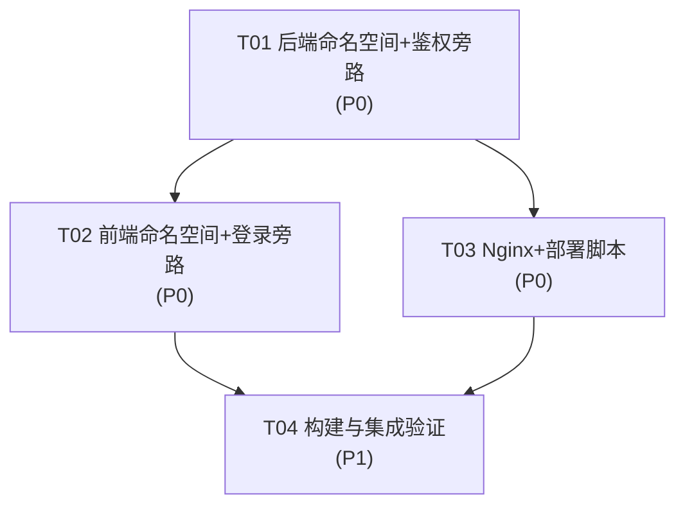
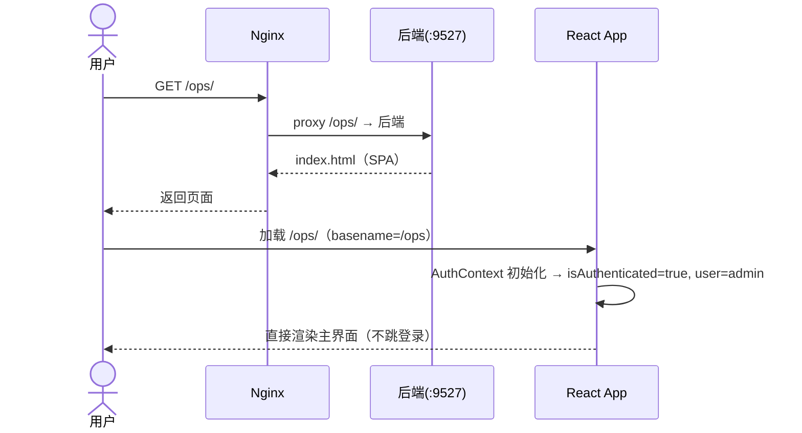
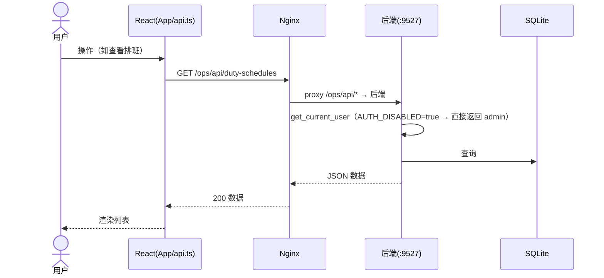

# inspection-system · OPS 命名空间隔离 + 取消登录 增量设计文档

> 作者：软件架构师（高见远） ｜ 类型：增量改造设计 + 任务分解 ｜ 状态：待实现
>
> 目标：把运维系统整体从根路径 / 与 `/api` 迁移到 **`/ops` 命名空间**，彻底避开与同机物料管理系统在 `/api/auth/login` 上的 Nginx 转发冲突；同时**取消登录**（内网开放、自动以 admin 身份进入），通过环境变量开关控制。

---

## 0. 技术栈确认（沿用，无新增框架）

| 层 | 现状（已读代码确认） | 改造策略 |
|----|----------------------|----------|
| 前端 | Vite 6 + React 19 + TypeScript + react-router-dom 6 + Tailwind | 仅改 `base` / `basename` / API baseURL / 登录旁路；**不引入新依赖** |
| 后端 | FastAPI + SQLAlchemy + SQLite + python-jose + bcrypt | 仅改路由挂载前缀 / 鉴权依赖 / StaticFiles 挂载点；**不引入新依赖** |
| 部署 | Nginx + systemd + `server-setup.sh` 一键脚本 | 仅改 `location` 规则与注入的环境变量 |

---

## 1. 实现方案概览

### 1.1 根因
- Nginx 同一 server 块里 `location /api/ { proxy_pass 127.0.0.1:9527 }` 把**物料系统**的 `/api/auth/login` 也转发到了运维 9527 → 报 “手机号或密码错误”。
- 解决：运维系统所有路由收进 `/ops` 前缀，Nginx 用 `location /ops/ { proxy_pass ...:9527 }` 单独转发，与物料系统的 `/` 和 `/api/` 物理隔离。

### 1.2 改造前后路由映射

| 能力 | 改造前 | 改造后 |
|------|--------|--------|
| 前端页面 | `https://host/` | `https://host/ops/` |
| API 基础路径 | `/api` | `/ops/api` |
| 登录接口 | `/api/auth/login` | `/ops/api/auth/login`（保留为兼容空操作） |
| 用户/排班/机房等 | `/api/users…` `/api/duty-schedules…` | `/ops/api/users…` `/ops/api/duty-schedules…` |
| CAD 模块 | `/api/cad/...` | `/ops/api/cad/...` |
| 资料管理 | `/api/assets/...` | `/ops/api/assets/...` |
| 上传文件 | `/ops/uploads/...`（已决策命名空间化，含幂等 DB 迁移） | `/ops/uploads/...`（上传命名空间化 + 迁移） |
| 静态资源 | `/assets/...` + `/vite.svg` | `/ops/assets/...` + `/ops/vite.svg` |
| 健康检查 | `/api/health` | `/ops/api/health` |

### 1.3 后端路由收口策略（关键设计）
把 `main.py` 内联的 `@app.get("/api/...")` 系列整体迁到一个**顶层路由器**：

```python
# backend/main.py（示意，非完整实现）
from fastapi import APIRouter
from dependencies import get_current_user, require_admin, AUTH_DISABLED  # 新增共享依赖

api_router = APIRouter(prefix="/ops/api")        # ① 顶层前缀统一收口

# ② 子路由前缀去掉 /api，交给 api_router 拼装
api_router.include_router(cad_router)            # cad_routes.prefix 改为 "/cad" → /ops/api/cad
api_router.include_router(asset_router)          # asset_routes.prefix 改为 "/assets" → /ops/api/assets

# ③ 原 @app.get("/api/health") 等全部改为 @api_router.get("/health") 并去掉路径里的 /api
@app.get("/ops/api/health")  ->  @api_router.get("/health")

app.include_router(api_router)                   # ④ 挂载
```

> 这样**前端只需改 baseURL 与 `assetApi.ts` 的相对前缀**，后端一处 `prefix="/ops/api"` 即可统一收口，避免逐个改 40+ 路由。

---

## 2. 文件清单（改 / 新增）

| 文件路径 | 操作 | 关键改动 |
|----------|------|----------|
| `backend/dependencies.py` | **新增** | 抽出共享 `get_current_user` / `require_admin` + `AUTH_DISABLED` 开关（消除 main.py 与 asset_routes.py 的重复实现） |
| `backend/main.py` | 改 | 顶层 `api_router(prefix="/ops/api")`；内联 `/api/*` 路由迁到 `api_router`；StaticFiles 改挂 `/ops/assets`；SPA fallback 改 `/ops` 与 `/ops/{path}`；新增 `/ops/vite.svg`；`/` 重定向 `/ops`；移除本地 `get_current_user/require_admin/DEV_MODE` |
| `backend/cad_routes.py` | 改 | `APIRouter(prefix="/cad")`（原 `/api/cad`） |
| `backend/asset_routes.py` | 改 | `APIRouter(prefix="/assets")`（原 `/api/assets`）；本地 `_get_current_user/_require_admin` 改为从 `dependencies` 导入 |
| `backend/auth.py` | 不改 | 仅说明（维持 JWT 工具） |
| `backend/database.py` | 不改 | DB 路径 `backend/app.db` 不变 |
| `backend/.env.example` | 改 | 新增 `DISABLE_AUTH` 说明 |
| `backend/.env` | 改 | 写入 `DISABLE_AUTH=true` |
| `vite.config.ts` | 改 | `base: '/ops/'`；dev proxy 改为 `/ops/api`（**仅 API**，勿代理整段 `/ops`，见 §3.4） |
| `src/config.ts` | **新增** | 前端单一真源：`APP_BASE='/ops'`、`API_BASE='/ops/api'` |
| `src/App.tsx` | 改 | `BrowserRouter basename="/ops"`；移除 `ProtectedRoute` 登录守卫与 `/login` 路由；`index`→`/dashboard` |
| `src/contexts/AuthContext.tsx` | 改 | 初始化即置 `isAuthenticated=true` + 合成 admin 用户，跳过 token 校验与 `getMe` |
| `src/services/api.ts` | 改 | `API_BASE_URL` 默认 `/ops/api`（用 `src/config.ts` 的 `API_BASE`） |
| `src/services/assetApi.ts` | 改 | `BASE` 维持 `'/assets'`（相对 API 前缀，最终 `/ops/api/assets`）；更新注释 |
| `src/pages/LoginPage.tsx` | 改/删 | 从 `App.tsx` 移除引用（建议删除文件） |
| `src/pages/CADPage.tsx` | 改 | `fetch('/api/cad/upload')`→`/ops/api/cad/upload`；导出地址改用 `API_BASE` |
| `src/components/users/AvatarUpload.tsx` | 改 | `fetch('/api/upload/avatar')`→`/ops/api/upload/avatar` |
| `.env.development` | 改 | `VITE_API_URL=/ops/api` |
| `.env.production` | 改 | `VITE_API_URL=/ops/api` |
| `index.html` | 不改（构建时 base 自动处理 favicon） | 说明 |
| `deploy/nginx-inspection.conf` | 改 | 新增 `location /ops/ → 9527` 与 `location /ops/uploads/ → 9527`；删除旧的 `/`、`/api/`、`/assets/`、`/uploads/`、`/vite.svg` 块（避免与物料系统冲突） |
| `deploy/server-setup.sh` | 改 | 健康检查改为 `/ops/api/health`；注入 `DISABLE_AUTH=true` |
| `deploy/inspection.service` | 改 | `Environment=DISABLE_AUTH=true` |

---

## 3. 路由改造方案（前后端）

### 3.1 前端 `vite.config.ts`
```ts
export default defineConfig({
  base: '/ops/',                      // ← 新增：所有产物路径前缀 /ops/
  plugins: [react()],
  resolve: { alias: { '@': path.resolve(__dirname, './src') } },
  server: {
    port: 5173,
    proxy: {
      // 仅代理 API；SPA 与 /ops 下的静态资源由 vite dev 自身服务，勿代理整段 /ops
      '/ops/api': { target: 'http://127.0.0.1:9527', changeOrigin: true },
      '/uploads': { target: 'http://127.0.0.1:9527', changeOrigin: true },  // 保留运维上传
    },
  },
})
```

### 3.2 前端统一常量 `src/config.ts`（新增，避免三处字符串漂移）
```ts
export const APP_BASE = '/ops'       // react-router basename
export const API_BASE = '/ops/api'   // 所有 fetch 前缀
```

### 3.3 前端 `src/services/api.ts`
```ts
import { API_BASE } from '@/config'
const API_BASE_URL = import.meta.env.VITE_API_URL || API_BASE   // 默认 '/ops/api'
// request() 内部 fetch(`${API_BASE_URL}${endpoint}`) 不变
```
`src/services/assetApi.ts`：`const BASE = '/assets'`（相对 API 前缀）→ 实际请求 `/ops/api/assets/...`，与后端 `asset_router(prefix="/assets")` 一致，**无需改 BASE 值**。

### 3.4 前端 `src/App.tsx`
```tsx
import { BrowserRouter, Routes, Route, Navigate } from 'react-router-dom'
// 移除 LoginPage / ProtectedRoute 登录守卫
export default function App() {
  return (
    <BrowserRouter basename="/ops">     {/* ← 关键 */}
      <AuthProvider>
        <ErrorBoundary>
          <Routes>
            <Route path="/" element={<MainLayout />}>   {/* 不再包 ProtectedRoute */}
              <Route index element={<Navigate to="/dashboard" replace />} />
              <Route path="dashboard" element={<DashboardPage />} />
              {/* …其它业务路由保持不变… */}
            </Route>
            <Route path="*" element={<Navigate to="/dashboard" replace />} />
          </Routes>
        </ErrorBoundary>
      </AuthProvider>
    </BrowserRouter>
  )
}
```
> 注意：`basename="/ops"` 后，所有 `<Link to="/dashboard">` 实际落到 `/ops/dashboard`，无需逐条改。

### 3.5 后端 `main.py` 路由收口（核心，见 §1.3）
- 新建 `api_router = APIRouter(prefix="/ops/api")`，把全部 `@app.get/post("/api/...")` 改为 `@api_router.get/post("/...")`（去掉路径中的 `/api`）。
- `app.include_router(api_router)`，并在其内 `api_router.include_router(cad_router)` / `asset_router`。
- 子路由文件 `cad_routes.py`、`asset_routes.py` 的 `prefix` 由 `/api/cad`、`/api/assets` 改为 `/cad`、`/assets`。

---

## 4. 取消登录机制（DISABLE_AUTH 自动 admin）

### 4.1 环境变量开关（命名建议）
- 新增 `DISABLE_AUTH=true` 作为**生产内网开放**开关（语义清晰）。
- 复用既有 `DEV_MODE=true` 作为开发跳过鉴权。
- 二者任一为 true 即视为“免鉴权 admin 模式”：`AUTH_DISABLED = DISABLE_AUTH or DEV_MODE`。
- 服务器 `backend/.env` 与 `inspection.service` 注入 `DISABLE_AUTH=true`；`.env.example` 增补说明。

### 4.2 后端 `backend/dependencies.py`（新增，统一鉴权逻辑）
```python
# 示意：把 main.py 与 asset_routes.py 重复的鉴权逻辑合并
import os
from sqlalchemy.orm import Session
from fastapi import Depends, Header, HTTPException, status
from database import get_db, User
from auth import get_password_hash

DEV_MODE = os.getenv("DEV_MODE", "false").lower() in ("true", "1")
DISABLE_AUTH = os.getenv("DISABLE_AUTH", "false").lower() in ("true", "1")
AUTH_DISABLED = DEV_MODE or DISABLE_AUTH

def _ensure_admin(db: Session) -> User:
    admin = db.query(User).filter(User.role == "admin").first()
    if admin:
        return admin
    admin = User(email="admin@system.local", name="系统管理员",
                 phone="00000000000", password_hash=get_password_hash("admin123456"),
                 role="admin")
    db.add(admin); db.commit(); db.refresh(admin)
    return admin

def get_current_user(authorization: str | None = Header(None), db: Session = Depends(get_db)) -> User:
    if AUTH_DISABLED:                       # ← 免鉴权直接返回 admin
        return _ensure_admin(db)
    # 以下保持原 JWT 校验逻辑不变
    if not authorization or not authorization.startswith("Bearer "):
        raise HTTPException(status_code=401, detail="请先登录")
    ...

def require_admin(current_user: User = Depends(get_current_user)) -> User:
    if current_user.role != "admin":
        raise HTTPException(status_code=403, detail="需要管理员权限")
    return current_user
```
- `main.py`：删除本地 `get_current_user/require_admin/DEV_MODE`，改为 `from dependencies import get_current_user, require_admin, AUTH_DISABLED`。
- `asset_routes.py`：删除本地 `_get_current_user/_require_admin` 定义，改为 `from dependencies import get_current_user as _get_current_user, require_admin as _require_admin`（其余 `Depends(_get_current_user)` 不动）。
- `/ops/api/auth/login`：保留为兼容空操作——`AUTH_DISABLED` 时忽略密码直接返回 admin 用户 + 占位 token（前端不再调用，仅为平滑兼容）。

### 4.3 前端 `src/contexts/AuthContext.tsx`（跳过登录）
```tsx
export function AuthProvider({ children }) {
  // 免登录：启动即视为已登录 admin，不再读 localStorage token / 不再调 getMe
  const [user] = useState<User>({ id: 0, name: '系统管理员', role: 'admin' })
  const isAuthenticated = true
  const isLoading = false
  const login = async () => true      // 保留签名，实际不再跳转
  const logout = () => {}             // 保留签名，实际无操作
  const refreshUser = async () => {}
  return (<AuthContext.Provider value={{ isAuthenticated, isLoading, login, logout, user, refreshUser }}>
    {children}
  </AuthContext.Provider>)
}
```
> `api.ts` 中的 `token` 设置/`Authorization` 头逻辑**可保留**（AUTH_DISABLED 时后端忽略），但前端不再调用 `login()`，故不会再写入 token，对功能无副作用。

---

## 5. StaticFiles 与 SPA fallback 改造

```python
# backend/main.py
BASE_DIR = os.path.dirname(os.path.abspath(__file__))
DIST_DIR = os.path.join(os.path.dirname(BASE_DIR), "dist")
DIST_ASSETS_DIR = os.path.join(DIST_DIR, "assets")

# ① 上传保持顶层（与 nginx /uploads/ 一致，不动 DB/前端）
app.mount("/uploads", StaticFiles(directory=os.path.join(BASE_DIR, "uploads")), name="uploads")
# ② 静态资源挂到 /ops/assets
if os.path.exists(DIST_ASSETS_DIR):
    app.mount("/ops/assets", StaticFiles(directory=DIST_ASSETS_DIR), name="ops-assets")

# ③ SPA fallback（仅兜底 /ops 空间，避免吞掉其它顶层路由）
@app.get("/ops/vite.svg")
def serve_vite_svg():
    p = os.path.join(DIST_DIR, "vite.svg")
    return FileResponse(p, media_type="image/svg+xml") if os.path.exists(p) else FileResponse(os.path.join(DIST_DIR, "index.html"))

@app.get("/ops")
@app.get("/ops/")
def serve_ops_index():
    return FileResponse(os.path.join(DIST_DIR, "index.html"), media_type="text/html")

@app.get("/ops/{full_path:path}")
def serve_ops_spa(full_path: str):
    # 不存在的文件回落到 index.html（SPA 路由）
    candidate = os.path.join(DIST_DIR, full_path)
    if os.path.isfile(candidate):
        return FileResponse(candidate)
    return FileResponse(os.path.join(DIST_DIR, "index.html"), media_type="text/html")

@app.get("/")
def root_redirect():
    return RedirectResponse("/ops/")   # 直连 IP:9527 时友好跳转
```

> 匹配优先级：`/ops/assets/*`（mount）→ `/ops/api/*`（显式路由）→ `/ops/vite.svg` / `/ops/` / `/ops/{path}`（SPA）。显式路由优先于 `{path}` 通配，API 不会被 fallback 吞掉。

---

## 6. Nginx 改造（`deploy/nginx-inspection.conf`）

```nginx
server {
    listen 443 ssl;
    server_name 82.156.62.59;
    ssl_certificate     /etc/nginx/ssl/inspection.crt;
    ssl_certificate_key /etc/nginx/ssl/inspection.key;
    ssl_protocols       TLSv1.2 TLSv1.3;
    client_max_body_size 50m;

    # ===== 运维系统命名空间 /ops/ → 后端 9527（透传完整路径）=====
    location = /ops { return 301 /ops/; }
    location /ops/ {
        proxy_pass http://127.0.0.1:9527;          # 无 URI，保留完整 /ops/... 路径
        proxy_set_header Host              $host;
        proxy_set_header X-Real-IP         $remote_addr;
        proxy_set_header X-Forwarded-For   $proxy_add_x_forwarded_for;
        proxy_set_header X-Forwarded-Proto $scheme;
        proxy_read_timeout 60s;
    }

    # ===== 运维上传（命名空间化到 /ops/uploads，与物料系统隔离）=====
    location /ops/uploads/ {
        proxy_pass http://127.0.0.1:9527;
        proxy_set_header Host $host;
    }

    # ===== 物料系统的 / 与 /api/ 由物料系统自身 conf 提供，本文件不再声明，避免重复 location 冲突 =====
    # location /api/  { proxy_pass http://127.0.0.1:<MATERIAL_PORT>; }
    # location /      { root <MATERIAL_DIST>; try_files $uri $uri/ /index.html; }
}
```

要点：
- `proxy_pass http://127.0.0.1:9527;`（**不带 URI**）使 `/ops/api/health` → 后端 `/ops/api/health`，与后端前缀一致。（你原方案 `proxy_pass ...:9527/ops/;` 亦可，但需保证 `location /ops/` 与尾部斜杠严格匹配；无 URI 写法更稳。）
- **必须删除**本文件内旧的 `location / { root inspection/dist }`、`location /api/ { proxy_pass 9527 }`、`location /assets/`、`location = /vite.svg`，否则会与物料系统冲突或抢走 `/api/`。
- **CORS**：后端 `allow_origins=["*"]` 维持不变。由于页面与 `/ops/api` 同源（同一 nginx host），浏览器不触发跨域预检，维持现状即可。
- **WebSocket**：全项目无 WS（已确认无 `websockets` 依赖/代码），`/ops/` 无需加 `Upgrade` 头。

---

## 7. 共享约定（跨文件一致）

| 约定 | 后端 | 前端 |
|------|------|------|
| 应用前缀 | `prefix="/ops"`（隐含于 api_router 与 StaticFiles /ops/*） | `src/config.ts` → `APP_BASE='/ops'`；`App.tsx` `basename="/ops"` |
| API 前缀 | `api_router = APIRouter(prefix="/ops/api")` | `API_BASE='/ops/api'`（vite proxy `/ops/api`、`.env` `VITE_API_URL=/ops/api`） |
| 上传前缀 | `app.mount("/uploads", ...)`（顶层，不动） | 前端按 API 返回的 URL 直接使用，不拼接 |
| 免鉴权开关 | `DISABLE_AUTH` / `DEV_MODE` → `AUTH_DISABLED` | 无（前端恒为 admin） |

> 改前缀时只需同步三处：后端 `api_router` 前缀、前端 `src/config.ts`、`.env.*` 的 `VITE_API_URL`。

---

## 8. 有序任务列表（按实现顺序，含依赖）

| Task | 名称 | 源文件（改/新增） | 依赖 | 优先级 |
|------|------|-------------------|------|--------|
| **T01** | 后端命名空间 + 鉴权旁路（基础设施） | `backend/dependencies.py`(新)、`backend/main.py`、`backend/cad_routes.py`、`backend/asset_routes.py`、`backend/.env.example` | — | P0 |
| **T02** | 前端命名空间 + 登录旁路 | `vite.config.ts`、`src/config.ts`(新)、`src/App.tsx`、`src/contexts/AuthContext.tsx`、`src/services/api.ts`、`src/services/assetApi.ts`、`src/pages/CADPage.tsx`、`src/components/users/AvatarUpload.tsx`、`.env.development`、`.env.production`、`src/pages/LoginPage.tsx`(移除引用) | T01 | P0 |
| **T03** | Nginx 与部署脚本 | `deploy/nginx-inspection.conf`、`deploy/server-setup.sh`、`deploy/inspection.service`、`backend/.env` | T01 | P0 |
| **T04** | 构建与集成验证 | `dist/`(构建产物)、`backend/main.py`(运行)、`deploy/nginx-inspection.conf`(`nginx -t`)、验证命令 | T02, T03 | P1 |

### 8.1 任务依赖图



### 8.2 执行顺序说明
1. **T01 先行**：后端先收口 `/ops/api`，其它层才有稳定的 URL 契约。
2. **T02 / T03 并行**（均仅依赖 T01）：前端改 base/登录、运维改 Nginx，互不阻塞。
3. **T04 收尾**：`npm run build` → 重启后端 → `nginx -t && reload` → `curl /ops/api/health` + 浏览器访问 `/ops/` 验证自动 admin 进入。

> 注：按“单文件即任务”的禁忌，这里把“后端”/“前端”/“部署”/“验证”按层分组，每组 ≥3 个文件，符合最小粒度与依赖扁平化要求。

---

## 9. 依赖包（确认无新增）
- **后端**：`requirements.txt` 不变（FastAPI / SQLAlchemy / python-jose / bcrypt / uvicorn / python-dotenv / pydantic 均已具备）。
- **前端**：`package.json` 不变（`react-router-dom` 已含；新增仅为 `src/config.ts` 常量文件，无依赖）。
- 仅新增 2 个**自研模块文件**：`backend/dependencies.py`、`src/config.ts`。

---

## 10. 待明确事项 / 风险点

1. **`/uploads/` 命名空间冲突（重要）**：本设计**保持上传在顶层 `/uploads/`**，前提是物料系统不使用 `/uploads/`。若物料系统也用 `/uploads/`，则必须把它也命名空间化到 `/ops/uploads`，需同步：
   - 后端 `app.mount("/ops/uploads", ...)` + `avatar_url`/`img_url` 生成改为 `/ops/uploads/...`；
   - **一次性 DB 迁移**（SQLite）：
     ```sql
     UPDATE users  SET avatar  = REPLACE(avatar,  '/uploads/', '/ops/uploads/') WHERE avatar  LIKE '/uploads/%';
     UPDATE shift_tasks SET images = REPLACE(images, '/uploads/', '/ops/uploads/') WHERE images LIKE '%/uploads/%';
     ```
   - Nginx 改 `location /ops/uploads/ { proxy_pass 127.0.0.1:9527; }`，删除顶层 `/uploads/` 块。
   - *请团队确认物料系统是否占用 `/uploads/`，再决定是否启用此迁移。*
2. **开发访问地址变化**：`base:'/ops/'` 后，本地开发需访问 `http://localhost:5173/ops/`（而非根）。dev proxy 只代理 `/ops/api`，不能代理整段 `/ops`，否则会抢走 vite 自身服务的 `/ops/src/*` 与 `/ops/assets/*`。
3. **`index.html` favicon**：构建时 Vite 依 `base` 自动把 `/vite.svg` 改写为 `/ops/vite.svg`，后端已新增 `/ops/vite.svg` 路由，无需手改。
4. **`/ops/api/auth/login` 兼容**：保留但前端不再调用；若希望彻底移除，可删除该路由与 `LoginRateLimiter`（后续清理项，不在本次范围）。
5. **历史链接/书签**：旧根路径 `/` 与 `/dashboard` 将 404（SPA 已不在根）。建议物料系统侧或导航入口统一改指 `/ops/`。后端 `/` 已做 301 → `/ops/` 兜底。
6. **多 server 块冲突**：确保最终生效的 Nginx 配置中，`/api/`、`/` 只属于物料系统，`/ops/`、`/uploads/` 属于运维，且同一 server 内无重复 `location`。

---

## 附：关键调用时序（Mermaid）

### A. 页面加载 + 自动 admin（免登录）


### B. 业务 API 调用（/ops/api 收口）

